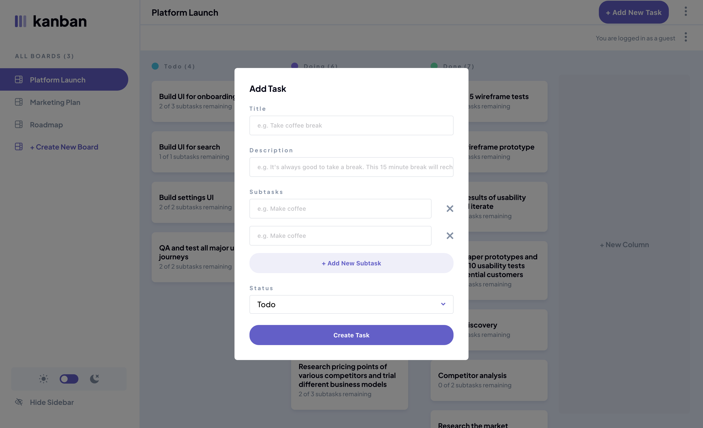
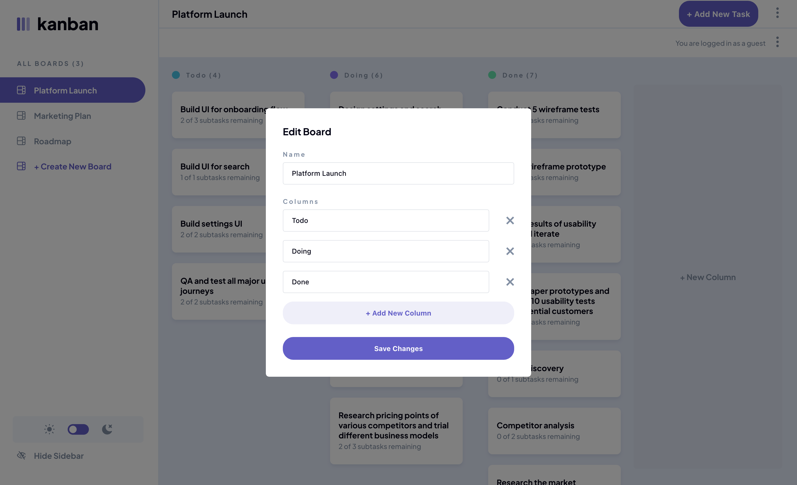
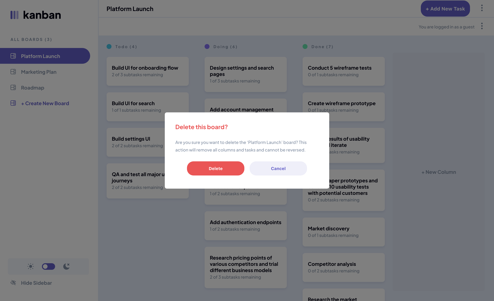
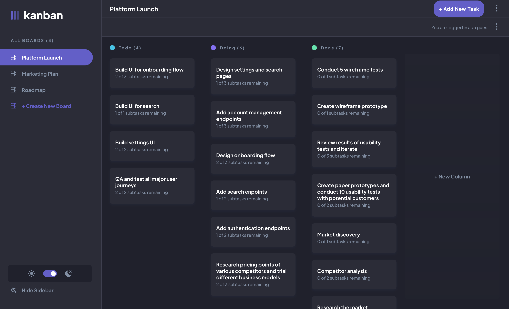
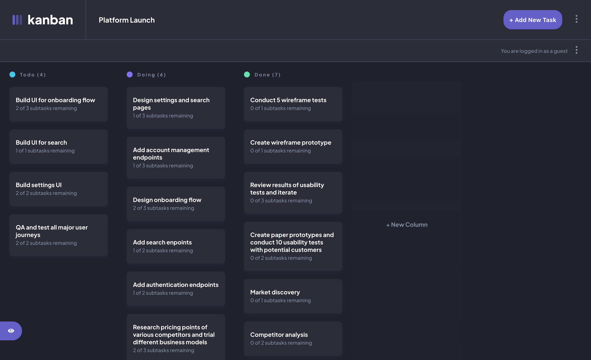
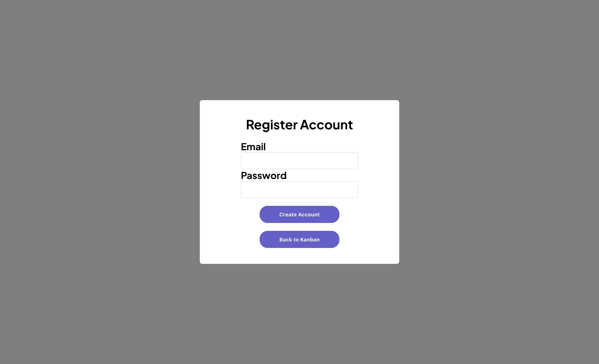
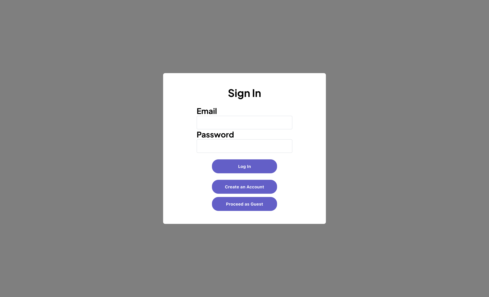

# Frontend Mentor - Kanban task management web app solution

This is a solution to the [Kanban task management web app challenge on Frontend Mentor](https://www.frontendmentor.io/challenges/kanban-task-management-web-app-wgQLt-HlbB). Frontend Mentor challenges help you improve your coding skills by building realistic projects. 

## Table of contents

- [Overview](#overview)
  - [The challenge](#the-challenge)
  - [Test coverage](#test-coverage)
  - [Screenshot](#screenshot)
  - [Links](#links)
- [My process](#my-process)
  - [Built with](#built-with)
  - [What I learned](#what-i-learned)
  - [Continued development](#continued-development)
- [Author](#author)

## Overview

### The challenge

Users should be able to:

- View the optimal layout for the app depending on their device's screen size
- See hover states for all interactive elements on the page
- Create, read, update, and delete boards and tasks
- Receive form validations when trying to create/edit boards and tasks
- Mark subtasks as complete and move tasks between columns
- Hide/show the board sidebar
- Toggle the theme between light/dark modes
- Users are able to drag and drop tasks to change their status and re-order them in a column
- User data is stored in firebase. Users can start out as a guest account and they have the opportunity to register their account for a given email and password

### Test Coverage

This project leverages 3 different testing strategies. 

Storybook: Components are initially created in isolation with storybook stories. These stories are used to spot check the components as they are being created. We currently do not have storybook-specific tests.

Unit: >70% unit test line coverage using React Testing Library. Test files are within the associated features/invoice folder for Redux. React component tests are within the src/components folder.

E2E: Playwright UI tests (tests/e2e.spec.ts) exists for these main user flows:
1. user can delete a board
1. user can delete a column
1. user can delete a task
1. user can add a board
1. user can add a task
1. user can add a column
1. user can update a column name
1. user can update a task via the edit task modal
1. user can update a task via the view task modal
1. user can log out

### Screenshot

### Links

- Solution URL: [https://github.com/landot/kanban-webapp](https://github.com/landot/kanban-webapp)
- Live Site URL: [https://timothyl-portfolio-kanban.netlify.app](https://timothyl-portfolio-kanban.netlify.app?continueAsGuest=true)

## My process

### Built with

- HTML
- CSS
- React
- Redux
- React Router
- Styled Components
- React Testing Library
- Storybook
- Playwright
- Vite

### What I learned

This website was my first personal project that I was proud of. Previously most of my portfolio projects were react-based that used static data to populate the page. 

I learned so much from this project. From using Redux to store, access, and edit data to using Firebase for user authentication and storage.

### Continued development

Areas for improvement:
Having gained confidence in building components with React, my upcoming goals include mastering newer frameworks such as Svelte, Vue, Gatsby, and NextJs.

Additionally, I am keen on exploring alternative state management solutions to Redux, with Zustand being one of the options I will investigate.

Looking ahead, I intend to ensure that all my future projects incorporate unit tests right alongside the development of their components.

## Author

- Portfolio Website - [https://timothyl-portfolio.netlify.app/](https://timothyl-portfolio.netlify.app/)
- github - [@landot](https://github.com/landot)
- Frontend Mentor - [@landot](https://www.frontendmentor.io/profile/landot)